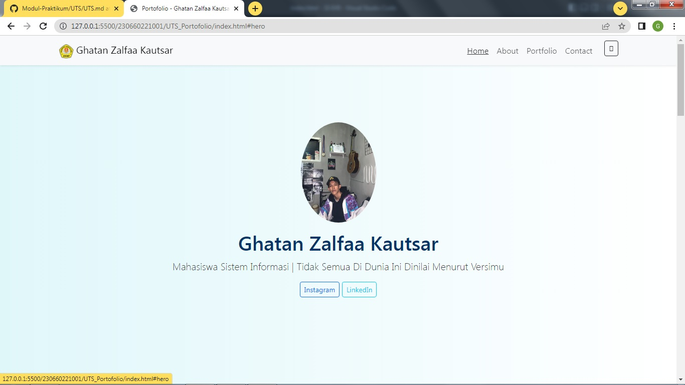
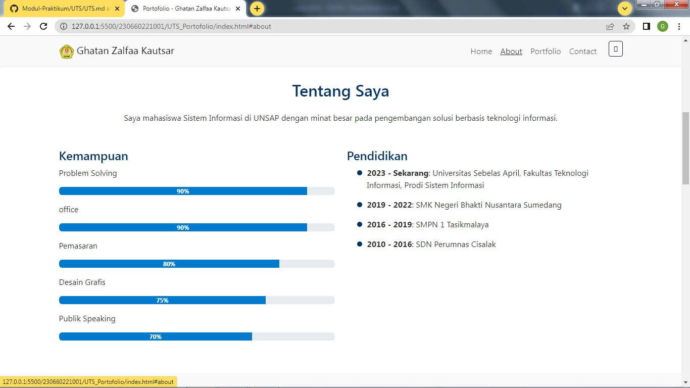
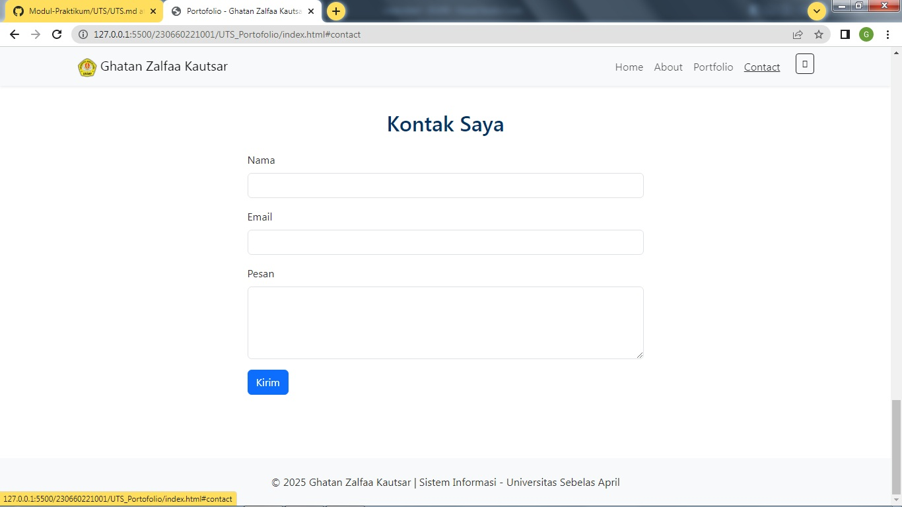
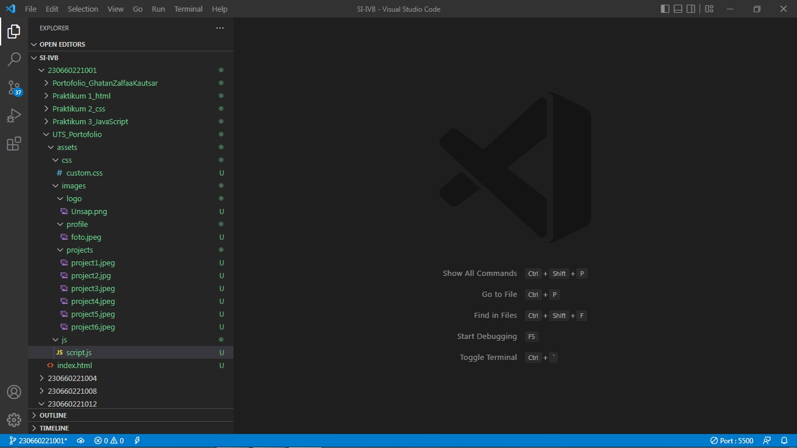

# UTS Pemrograman Berbasis Web - Portofolio

Proyek ini merupakan tugas Ujian Tengah Semester (UTS) mata kuliah **Pemrograman Berbasis Web** di Fakultas Teknologi Informasi, Program Studi Sistem Informasi, Universitas Sebelas April (UNSAP).

Portofolio ini dibangun menggunakan **HTML, CSS, JavaScript**, dan **Bootstrap 5**, serta dilengkapi dengan fitur interaktif sesuai modul.

---

## 👤 Data Mahasiswa

- **Nama:** Ghatan Zalfaa Kautsar
- **NPM:** 230660221001
- **Kelas:** SI-IVB

---

## 🖼️ Screenshot Hasil Akhir

Berikut tampilan akhir portofolio:

---

## 📬 Kontak

Untuk pertanyaan atau informasi lebih lanjut:

- Instagram: [@ghatanzk](https://instagram.com/ghatanzk)
- LinkedIn: [Ghatan Zalfaa Kautsar](https://linkedin.com/in/gathan-zalfaa-kautsar-92006a32b/)
