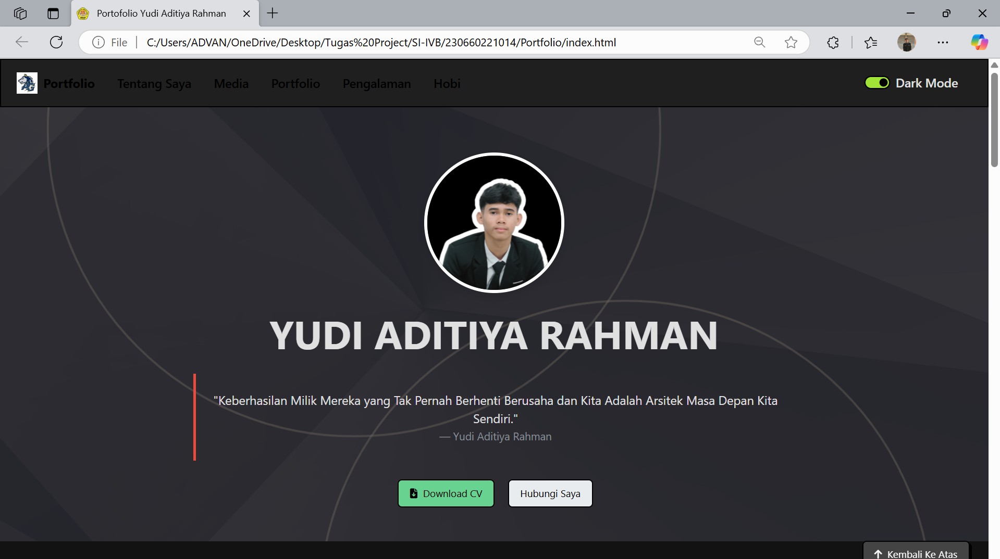
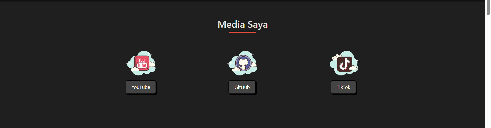
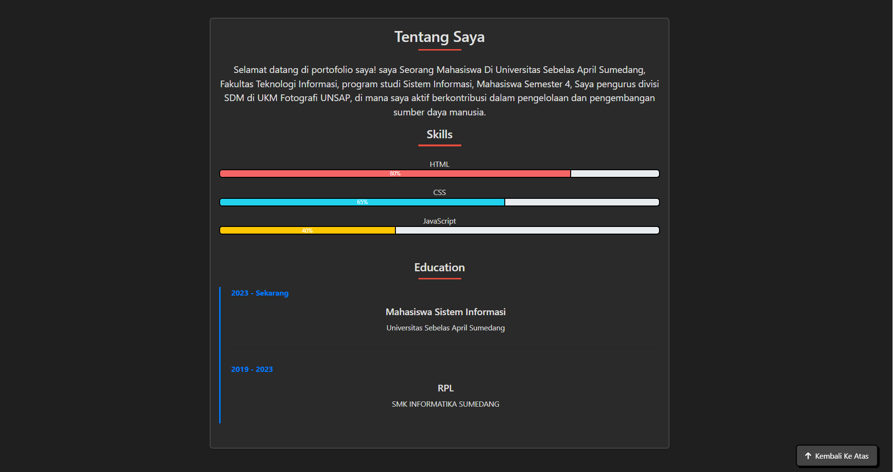
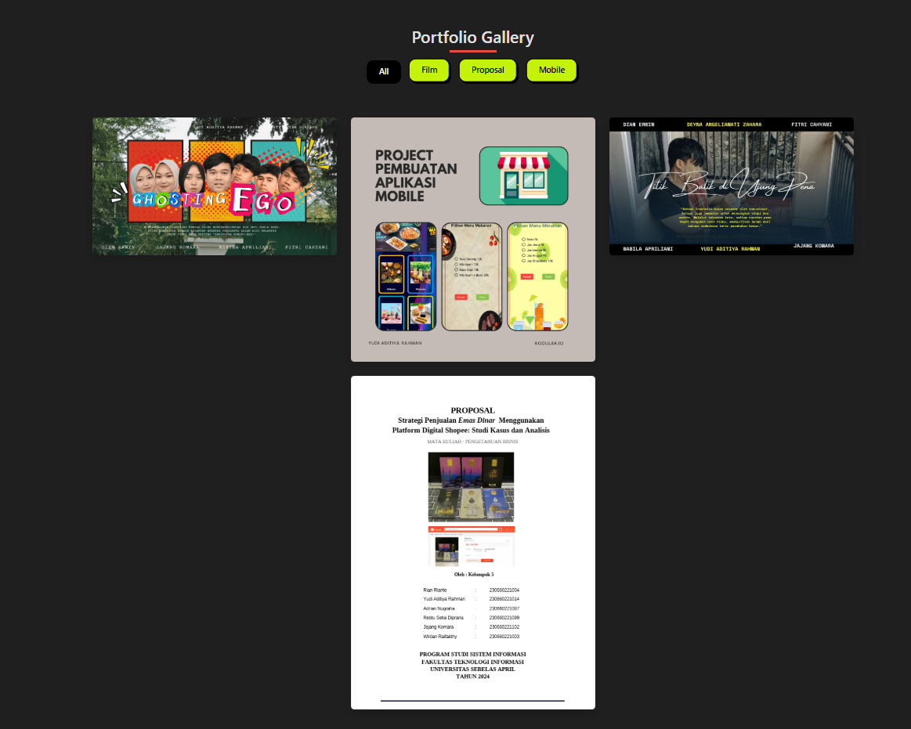
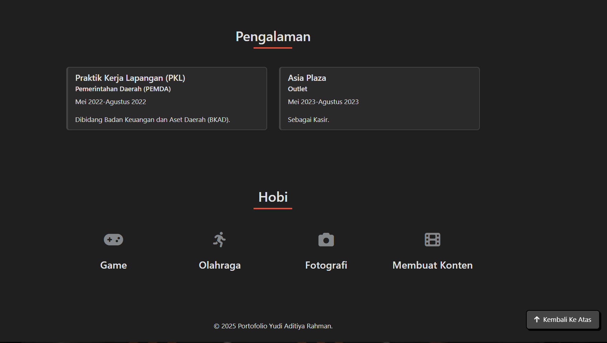
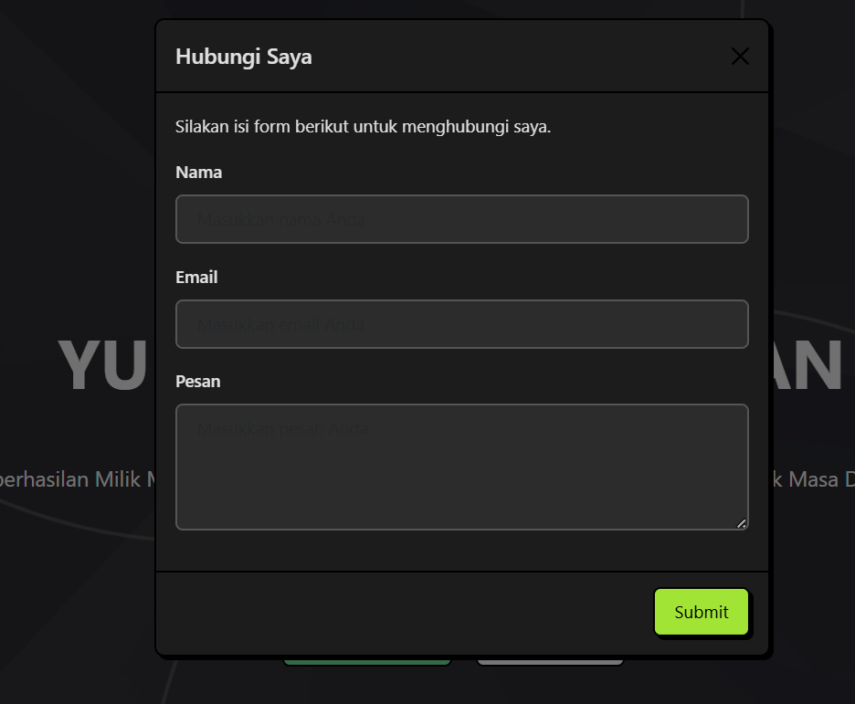

# 🌐 Portofolio Yudi Aditiya Rahman

Selamat datang di repositori portofolio saya! Ini adalah website portofolio pribadi saya yang menampilkan informasi tentang saya, keterampilan saya, pengalaman kerja, serta beberapa karya dan hobi saya. Dibangun menggunakan HTML, Bootstrap 5, dan JavaScript.

## 📄 Tentang Proyek

Website ini menyajikan:
- **Profil pribadi dan kutipan inspiratif**
- **CV yang dapat diunduh**
- **Informasi kontak dan modal form**
- **Tautan media sosial (YouTube, GitHub, TikTok)**
- **Daftar keterampilan dan riwayat pendidikan**
- **Galeri portofolio dengan filter berdasarkan kategori**
- **Pengalaman kerja dan kegiatan ekstrakurikuler**
- **Hobi dengan ikon visual**
- **Mode gelap yang dapat diaktifkan pengguna**

## 🛠️ Teknologi yang Digunakan

- HTML5
- CSS3 & Custom CSS
- JavaScript
- Bootstrap 5 (Tema: Brite)
- Font Awesome Icons

## 🧠 Fitur Utama

- 💡 **Dark Mode**: Pengguna dapat mengaktifkan mode gelap.
- 📁 **Galeri Portfolio**: Gambar proyek dengan kategori seperti Film, Mobile App, dan Proposal.
- 📩 **Modal Kontak**: Formulir interaktif untuk menghubungi langsung.
- 📜 **CV Download**: Tombol unduh CV.
- 🧰 **Skills Progress Bar**: Visualisasi kemampuan dengan bar persentase.

## 📂 Struktur Folder

├── assets/
│ ├── css/
│ │ └── custom.css
│ ├── docs/
│ │ └── Yudi CV.pdf
│ ├── image/
│ │ ├── bg/
│ │ ├── logo/
│ │ ├── profile/
│ │ └── project/
│ ├── icon/
│ │ └── social/
│ └── js/
│ └── script.js
└── index.html

## 📸 Screenshot Tampilan Website

Berikut adalah beberapa tampilan dari website:
## 💡 Tampilan Website (Light Mode)

### 🔹 Halaman Utama, Kontak Saya/Hubungi Saya & CV

### 🔹 Media

### 🔹 Tentang, Skill & Education

### 🔹 Portfolio Gallery

### 🔹 Pengalaman & Hobi

### 🔹 Hubungi Saya

## 🌙 Tampilan Website (Dark Mode)

### 🔹 Halaman Utama, Kontak Saya/Hubungi Saya & CV

### 🔹 Media

### 🔹 Tentang, Skill & Education

### 🔹 Portfolio Gallery

### 🔹 Pengalaman & Hobi

### 🔹 Hubungi Saya

