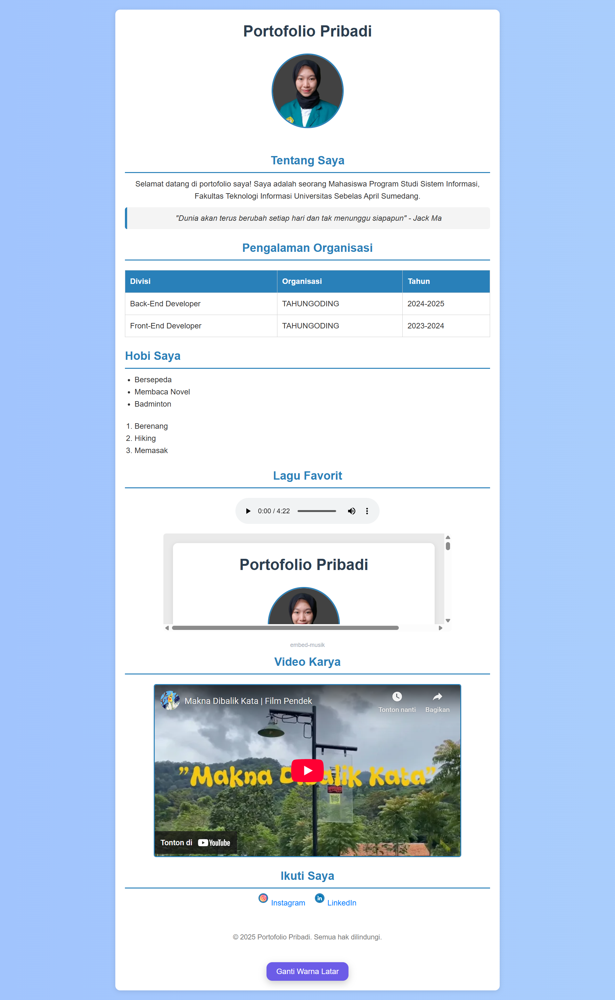

Folder Portofolio ini berisi seluruh aset pendukung untuk halaman portofolio yang disimpan di folder assets. Berikut struktur dan penjelasannya:  
📁 css/  
Berisi file CSS untuk mengatur tampilan halaman  
• custom.css – File utama untuk styling halaman seperti warna, layout dan yang lainnya  

📁 js/  
Berisi file JavaScript yang digunakan untuk memberikan interaksi dan efek visual  
• script.js – Script dasar untuk tombol "Ganti Warna Latar"  

📁 images/  
Berisi gambar yang digunakan di halaman web  
• intan.jpg – Gambar profil pengguna halaman  
(Dapat ditambahkan gambar lainnya sesuai kebutuhan)  

📁 icons/  
Berisi ikon media sosial atau ikon dekoratif lainnya  
• instagram.png – Ikon untuk tautan ke Instagram  
• linkedin.png – Ikon untuk tautan ke LinkedIn  

📁 docs/  
Berisi dokumen media atau file tambahan seperti audio  
• lagu.mp3 – Lagu favorit pengguna yang bisa diputar langsung dari halaman  

  
