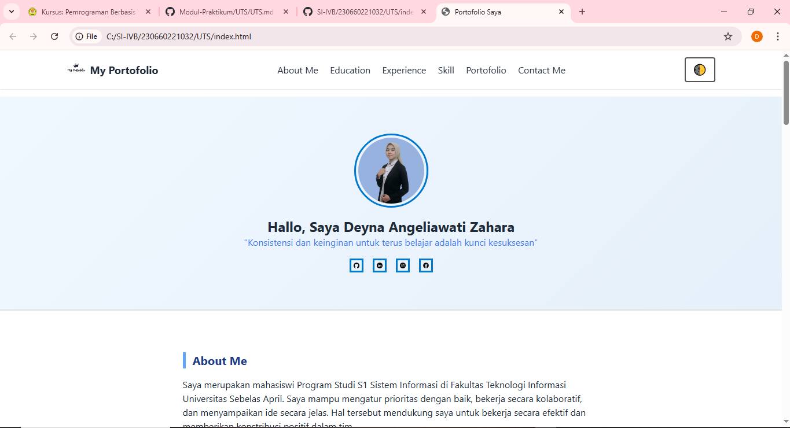
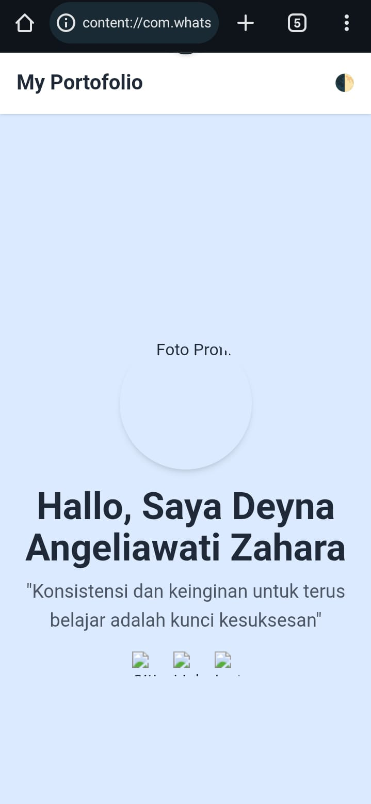

# Portfolio Website - Deyna Angeliawati Zahara - SI-IVB

proyek website portfolio profesional saya yang dibuat untuk memenuhi Ujian Tengah Semester (UTS) mata kuliah Pemrograman Berbasis Web Front End.

## Fitur Utama

### Komponen Wajib

- **Header/Navigation**
  - Navigasi responsif
  - Logo personal
  - Smooth scrolling
- **Hero Section**
  - Foto profil profesional
  - Nama dan tagline
  - Link ke media sosial
  - Animasi CSS
- **About Me**
  - Deskripsi pribadi
  - Skill bar interaktif
  - Timeline edukasi
- **Portfolio Gallery**
  - Grid proyek (6 item)
  - Lightbox preview
  - Filter kategori (JS)

### Fitur JavaScript
- Toggle **Dark/Light Mode**
- Validasi Formulir Kontak
- Animasi loading saat navigasi

### Styling & Responsiveness
- Desain modern (Flexbox & Grid)
- Responsif di semua device
- Custom animations & transitions

### Bonus
- Lazy loading untuk gambar
- Optimasi performa

## Screenshot Hasil Website

## Teknologi yang Digunakan
- HTML
- CSS 
- JavaScript