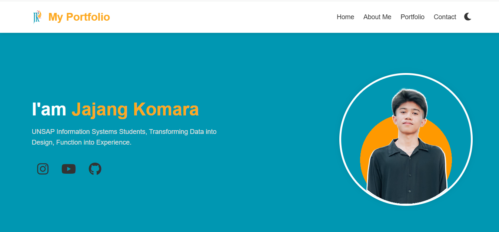
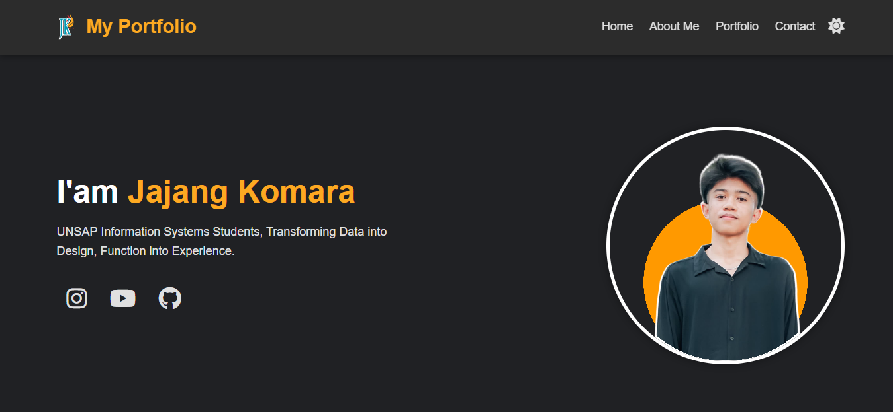

# 🔗 Portfolio Website
Ini adalah proyek yang dikembangkan sebagai bagian dari Ujian Tengah Semester (UTS) saya. Proyek ini berfokus pada pembangunan antarmuka pengguna interaktif menggunakan HTML, CSS, dan JavaScript, serta menjadi fondasi untuk portofolio pribadi ini.

## Preview Portfolio 📸
**Dark Mode Toggle ☀️:**

**Dark Mode Toggle 🌙:**



## Struktur Proyek 📂
Repositori ini diatur dengan struktur yang rapi untuk memudahkan navigasi:

                UTS/                  # Folder proyek portfolio
                │
                ├── index.html        # Halaman utama portfolio
                └── assets/
                ├── css/              # Stylesheets utama (CSS)
                │   ├── style.css  
                ├── js/               # Logika utama (JavaScript)
                │   └── script.js
                ├── images/           # Seluruh aset visual
                |   └── icon/         # Icon image
                │   ├── profile/      # Hero image
                │   ├── projectsport/ # Image portfolio
                │   ├── projects/     # Snapshoot proyek
                │   └── logo.svg      # Logo personal
                │
                │
                └── README.md         # Deskripsi proyek

## 🚀 Fitur Utama 
### 1.	Header/Navigation✅
* Menu navigasi responsif
* Logo personal
* Smooth scrolling ke setiap section
### 2.	Hero Section✅
* Foto profile profesional
* Nama dan tagline
* Social media links
### 3.	About Me✅
* Deskripsi personal
* Skills/expertise dengan progress bar
* Education timeline
### 4.	Portfolio Gallery ✅
* Grid layout dengan 6 proyek
* Lightbox preview untuk setiap proyek
* Filter kategori menggunakan JavaScript
### 5.	JavaScript fitur ✅
* Form contact dengan validasi 
* Dark/Light mode toggle 
### 6. Styling & Responsiveness ✅
* Desain modern & profesional
* Mendukung berbagai perangkat dengan media queries
* Konsistensi dalam color scheme ( #0097b2 dan #fda921)

## Cara Melihat Portofolio Ini 🖥️

Untuk melihat portofolio ini secara lokal di komputer Anda:

1.  **Clone repositori ini:**
    ```bash
    git clone [https://github.com/230660221102/nama-repositori-portofolio-anda.git](https://github.com/230660221102/nama-repositori-portofolio-anda.git)
    ```
2.  **Navigasi ke direktori proyek:**
    ```bash
    cd nama-repositori-portofolio-anda
    ```
3.  **Buka file `index.html`** di browser pilihan Anda.
    (Anda bisa langsung double-klik file `index.html` di explorer/finder Anda, atau menggunakan ekstensi "Live Server" jika Anda menggunakan VS Code untuk pengalaman pengembangan yang lebih baik.)

## Kontak 📩

Jangan ragu untuk menghubungi saya melalui:
* **Instagram:** [@ejaavin_](https://www.instagram.com/ejaavin_/) 📸
* **GitHub:** [230660221102](https://github.com/230660221102) 😺

Terima kasih telah mengunjungi portofolio saya! 🙏